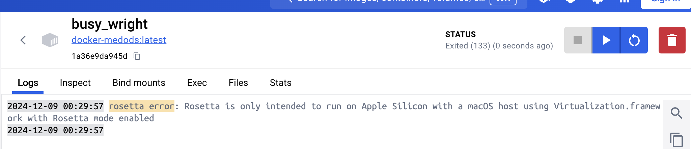

# Запуск программы

```shell
go run main.go
```

**Используемые технологии:**

- [x] Go 
- [x] JWT
- [ ] PostgreSQL: я просто забыл что можно использовать СУБД, и постарался разработать структуру данных сам.
- [ ] Docker: хотел обернуть в контейнер но на macOS он перестал работать "rosetta error", видимо из-за apple CPU



**Требования:**

- Access токен тип JWT, алгоритм SHA512, хранить в базе строго запрещено.

```go
type AuthorizedUser struct {
    uuid       string
    email      string
    ip         string
    aExpiresAt int64
    rToken     string
    rExpiresAt int64
    revoked    string
}
```

В базе хранятся только два токена это актуальный захэшированный rerfreshToken (rToken string) и НЕ хэшированный предыдущий refresh token (revoked string).

- Refresh токен тип произвольный, формат передачи base64, хранится в базе исключительно в виде bcrypt хеша.

```go
rtClaims := jwt.NewWithClaims(jwt.SigningMethodHS512, jwt.MapClaims{
    "email": user.Email,
    "ip":    user.Ip,
    "iss":   currentTime.Unix(),
})
```

- Должен быть защищен от изменения на стороне клиента и попыток повторного использования.

```go
if storage.GetRevokedStatus(currentUser) == rTokenString {
    fmt.Fprintf(w, "Old Token is used to refresh one more time\n")
    fmt.Fprintf(w, "All authorized sessions of that user will be ended\n")
    storage.DeleteAuthorizedUser(currentUser)
    return
}
```

Если есть второй запрос на обновление старым токеном, то система удаляет авторизацию данного пользователя по его uuid, чтобы в дальнейшем он авторизовался по новой.

- Access, Refresh токены обоюдно связаны, Refresh операцию для Access токена можно выполнить только тем Refresh токеном который был выдан вместе с ним.

```go
if !utils.CheckTokenHash(rTokenString, storage.GetRefreshToken(currentUser)) {
        fmt.Fprintf(w, "Refresh Token not credential")
        return
    } else {
        refreshedUser := storage.UserDTO{
            Uuid:  storage.GetUUID(currentUser),
            Email: storage.GetEmail(currentUser),
            Ip:    storage.GetIP(currentUser),   
        }
```

В данном фрагменте кода сравниваются refresh token который содержался в куки запроса и refresh token захэшированный в базе данных.

- Payload токенов должен содержать сведения об ip адресе клиента, которому он был выдан. В случае, если ip адрес изменился, при рефреш операции нужно послать email warning на почту юзера (для упрощения можно использовать моковые данные).

```go
authClaims := jwt.NewWithClaims(jwt.SigningMethodHS512, jwt.MapClaims{
    "sub":   user.Uuid,
    "email": user.Email,
    "ip":    user.Ip,
    "iss":   currentTime.Unix(),
})

rtClaims := jwt.NewWithClaims(jwt.SigningMethodHS512, jwt.MapClaims{
    "email": user.Email,
    "ip":    user.Ip,
    "iss":   currentTime.Unix(),
})
```

Оба токена содеражат информацию об IP пользователя полученный из его запроса. Что касается email отправки,пытался реализовывать через gmail, но доступ третьим приложениям стал deprecated. Большая часть туториалов показывают пример с gmail, также пытался релизовать mailin, но тот требовал хоста чтобы письмо успешно было отпарвлено.